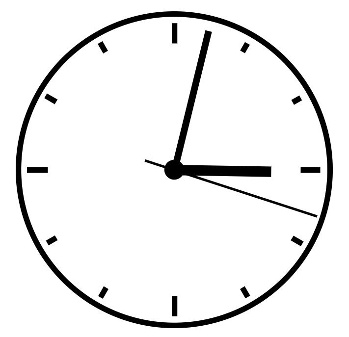

# Digital Analog Clock
This project consists of a simple web-based analog clock with a minimalistic design that displays the current time using SVG graphics. The clock includes hour, minute, and second hands that continuously update to reflect the current time.

## Clock Preview

## Usage
The clock is automatically set to the current time when the page is loaded. The clock hands move continuously to reflect the accurate time. The clock updates every second to ensure accuracy.